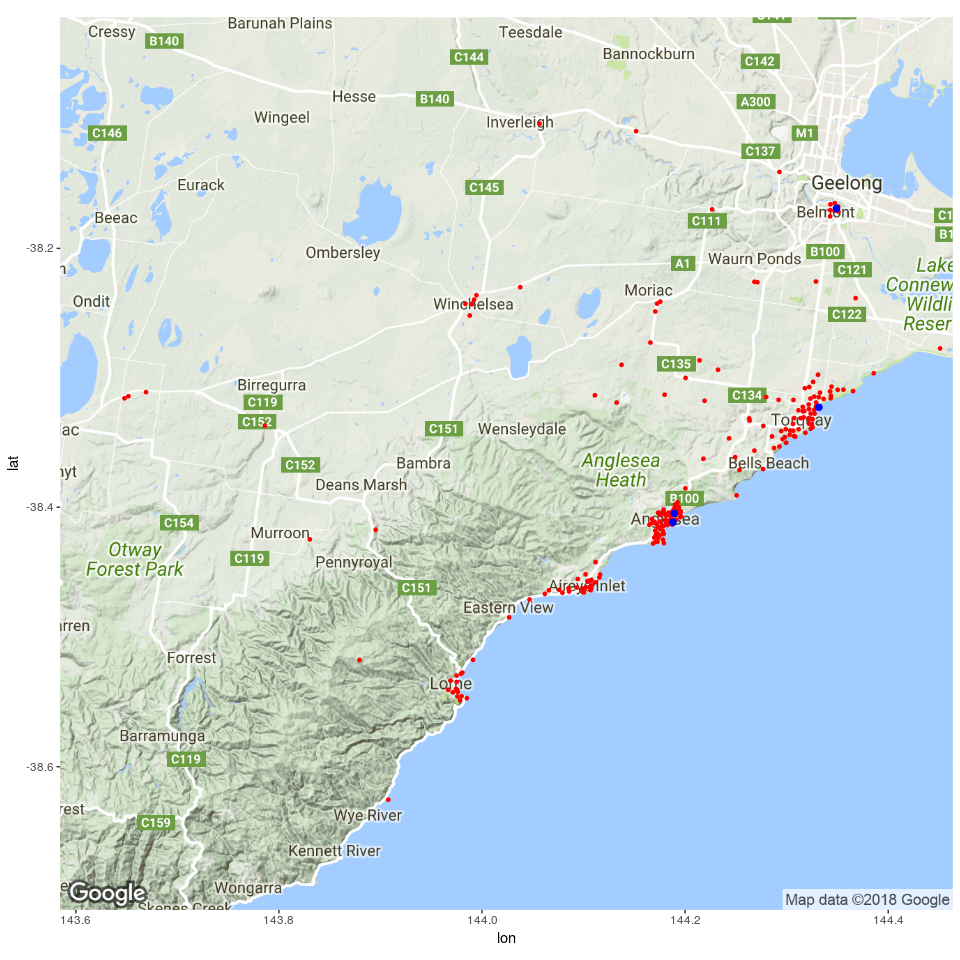
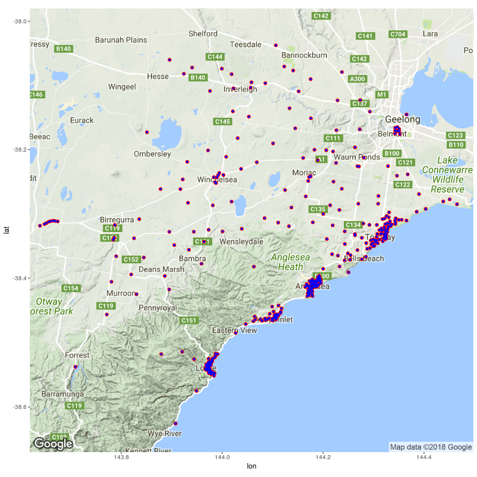

## Anglesea: `./trips-anglesea.csv.gz` 


Data columns:

```
## [1] "personID,actType,endTime,Node1,Y,X,Node2,DestY,DestX"
```

Number of unique persons:

```
## [1] 13616
```

Number of unique activity types:

```
## [1] 1
```

Number of unique origin nodes:

```
## [1] 222
```

Number of unique destination nodes:

```
## [1] 4
```


Plot of all nodes (*red=origins, blue=destinations*):
<!-- -->

## Surf Coast Shire: `./trips-scs.csv.gz` 


Data columns:

```
## [1] "person.id,act.end_time,Node.no1,type,Y,X,DestX,DestY,Node.no2"
```

Number of unique persons:

```
## [1] 144452
```

Number of unique activity types:

```
## [1] 14
```

Number of unique origin nodes:

```
## [1] 389
```

Number of unique destination nodes:

```
## [1] 389
```


Plot of all nodes (*red=origins, blue=destinations*):
<!-- -->
