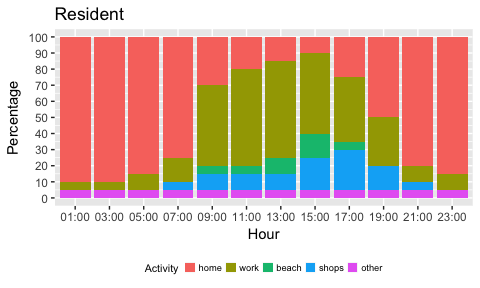

## Plan Algorithm Documentation

[Surf Coast Shire](https://www.openstreetmap.org/relation/3290432) is unique in its population makeup due to the high number of visitors to townships around the [Great Ocean Road](https://www.openstreetmap.org/relation/6592912). On a given summer day for instance, Anglesea that has a [resident population around `2600`](http://www.censusdata.abs.gov.au/census_services/getproduct/census/2016/quickstat/SSC20045) can have as many as `15000` persons in the township.  In looking to construct a synthetic population for Surf Coast Shire for the purposes of evacuation modelling, it is therefore important to consider the numbers as well as behaviours of the significant transient population in the region.


## Population subgroups

Within the model, we will account for the following groups of people (based on input from regional stakeholders):

* `resident` : as captured by the [ABS census data](http://www.censusdata.abs.gov.au/census_services/getproduct/census/2016/quickstat/LGA26490); several methods exist for creating a synthetic population for this cohort, and one that could be readily applied here is the [algorithm from Wicramasinghe et al.](https://github.com/agentsoz/synthetic-population) from RMIT University.
* `part-time resident` : people that own a property and spend an extended period of time in the region, but are not permanently based there.  (<mark>How will we define these as seperate from regular visitors (assuming they are derived from the same source)?</mark>)
* `regular visitor` : people that regularly visit the region during the summer months, camping or in *holiday homes*, and have a working knowledge of local roads and destinations; some information on this cohort could be derived from [VISTA data](https://transport.vic.gov.au/data-and-research/vista/). (<mark>Any other dataset that might give stats on this group?</mark>)
* `overnight visitor` : people that are visiting and staying the region for a short period of time in accommodation but do not have any knowledge of the area; some information on this cohort could be derived from [VISTA data](https://transport.vic.gov.au/data-and-research/vista/).
* `day visitor` : people that visit the region for the day or on a short-stay visit, and generally do not know the area well; some information on this cohort could be derived from [VISTA data](https://transport.vic.gov.au/data-and-research/vista/). (<mark>Any other dataset that might give stats on this group?</mark>)

## Activity types

The [initial work done by Surf Cost Shire Council](https://github.com/agentsoz/bdi-abm-integration/blob/ees/examples/bushfire/scenarios/surf-coast-shire/data/from-scsc-201804/analysis-data-from-scsc-201804.md#surf-coast-shire-trips-scscsvgz) looked at the following types of activites (counts): 
`Base`(144456)
`Beach`(5578)
`Business`(39399)
`Camp`(189)
`Caravan`(7986)
`EvacZone`(48370)
`Golf`(1508)
`Hotel`(2057)
`Kindergarten`(333)
`Primary`(1123)
`Secondary`(972)
`Shops`(36193)
`Tafe`(378)
`University`(370)

In the new model, these different activities can be consolidated into broad types. The granularity here is adjustable as desired, but to work in conjunction with MATSim it is better to maintain a small and constant set of activity types. The actual locations of these activities for each population subgroup can be varied instead, allowing flexibility and variation in the possible types of trips.

As an example, here are some possible activity types:

Activity | Description
---------- | -------------------------------------------------------------------
**`home`** |  assigns the person a home location; at the moment this is a requirement dictated by MATSim. These locations should be different for each population subgroup e.g. `resident` homes would be mapped to `EvacZone`, whereas `day visitors` would be mapped to somewhere outside the region (Geelong or Colac)  <mark>other suggestions welcome</mark>;
**`work`** |  at locations designated as work areas in the region (<mark>supplied by Surf Coast Shire Council</mark>); persons will be assigned arbitrary work location coordinates in these areas; the proportion of the resident population that forms the working cohort will be based on census data for the region (`ABS 2016: SCS had 90.6% employed of which 66% drive to work`). at present `work` is a specified string which ensures activities of this type are of double duration; 
**`shop`** | at locations that represent retail and grocery shops as well as dining places; <mark>supplied by Surf Coast Shire Council</mark> 
**`beach`** |  at areas designated as beach destinations along the coast (<mark>supplied by Surf Coast Shire Council</mark>); the population will have equal preference for all beaches; 
**`other`** | at arbitrary locations other than those above (not including commuting); will be used as needed to make daily plans coherent.

## Model description

The purpose of the model is to allow users to specify the makeup of the population for specific situations, such as `Typical summer weekday/weekend`, `Falls Festival day with FFDI=100`, and so on. The intent is to:

* make all inputs and assumptions about the underlying population explicit so that they can be more easily critiqued, debated, and agreed upon;
* allow differences between populations of different scenarios to be easily understood and described;
* allow users to generate populations for different scenarios easily and automatically; and
* formalise the method of producing such populations, so that they can be accurately reproduced.

## Model assumptions

1. Overall, individuals in the full population will differ in the makeup of their daily activity plans with respect to which activities they perform, when, for how long, and in which order.

1. All activities are assumed to be repeatable and can have a minimum duration of 2 hours (with the exception of `work`, which has a minimum duration of 4 hours).

1. Currently in the model *persons are synonomous with vehicles*. In other words, all vehicles accommodate a single person (the driver) and drivers are assummed to be co-located with their vehicles. For SCS, it *might be important to model persons walking to activities from their parked vehicles and back at the end of the activity*. This might be important for the `beach` activity in particular, where the time spent in walking from/to the parked vehicle might be significant; <mark>Discuss with working group</mark>.

1. Departure times for activities are randomly distributed within the two hour time block they are allocated to. This ensures that that traffic is dispersed throughout the day, rather than in centralised pulses, but might not fully capture peak traffic events (e.g. main traffic influx clustered around 9am/5am for work). Could potentially tie departure to expected time to destination, but would need some form of routing. 

1. Home locations are now assigned by **allocation**. The shape file now supplies per address location data, and should also specify an allocation for that address. In the simplest terms, this will be either `1` or `0`, indicating whether the address is inhabited or not. Once an address has been allocated, the allocation count decreases by one. The ``day visitor`` subgroup provides a good illustration of how this process will work when the home location has an allocation greater than `1`; a ``day visitor`` will select a "home" location from one of the ``Out of Region`` locations (``MELBOURNE``, ``COLAC`` or ``APOLLO BAY``). Because the counts for these locations are large, multiple agents will be assigned to the same location. The proportion coming in from each place can be shaped by the allocation count as well; say there are `100 day visitor` agents, and the count for ``MELBOURNE=80`` ``COLAC=10`` and ``APOLLO BAY=10``. Then 80% of the tourist traffic will come from Melbourne, and 20% from locations west of Anglesea. 
For a given subgroup, if the total allocation count for all locations that home maps to is less than the number of agents, then the algorithm automatically sets the allocation of each location to the number of agents in that subgroup. This ensures every agent has a home.  

1. The choices of location for the activities in a given plan are now selected based on **locality**. This means that instead of basing selection on Euclidean distance from home, agents now select their next activity from within a locality near their *current* locality; the new locality is selected based on a probability proportional to inverse distance. The current locality is preferred (to a varying degree based on subgroup type). The distance between localities is calculated using an average of all coordinate values for each locality to give a "centroid" node for each locality.

## Model inputs

*For each situation, for each population subgroup, users specify these inputs*:

* the number of agents (`numbers.csv`);
* the distribution of activites through the day`distributions.csv`;
* the locations that each specified activity maps to (`location_map.csv`);
* the probability of an agent from subgroup travelling outside of current location (`travel_factor.csv`).   

For instance, on a "typical summer weekday", the distribution input for the `resident` subgroup might look like:


```
##  home,90,90,85,75,30,20,15,10,25,50,80,85
##  work, 5, 5,10,15,50,60,60,50,40,30,10,10
## beach, 0, 0, 0, 0, 5, 5,10,15, 5, 0, 0, 0
## shops, 0, 0, 0, 5,10,10,10,20,25,15, 5, 0
## other, 5, 5, 5, 5, 5, 5, 5, 5, 5, 5, 5, 5
```

<!-- -->

and the location mappings input for `resident` would be established by:


```
## home,Residential,Isolated Property
## work,Business District
## beach,Beach
## shops,Shops
## other,School
```

## Model outputs

The output of the process is a **MATSim population (XML) file**, similar to what is currently used as input to the DSS, that describes the daily activity-plan for every individual in the population. An [example output XML file is here](./plans.xml).

## Adding EES BDI Attributes
Attributes can be added to the generated MATSim population file via the `BDI_attributes.R` script. The script will assign:

* **A BDI agent class** 

    Their subgroup type as specified in `numbers.csv`. The `BDI_attributes.R` script uses the same numbers input as the plan algorithm, so these numbers should match to the desired number and order in the input plan file (this is only really a concern when appending BDI attributes to an existing/outsourced MATSim plan file).

* **Initial and final response thresholds** 
    
    These are determined from a plausible range for each subgroup (`thresholds.csv`) and additionally, a file `stay.csv` that indicates `true` or `false` for each subgroup whether it is possible for an agent to decide to stay and defend. The final threshold will always be greater than or equal to the initial response (and always equal to if there is no chance of the agent staying and defending). 
    
* **With some probability, a dependent's location**

    The script will identify an agent's home location as the first location in their plan list. Each subgroup will have a percentage of agents with dependents (`dependents.csv`) and if an agent is allocated a dependent, the dependent's lcoation will be placed randomly within 20km of home. If the agent does not have a dependent, this field is empty.
    
* **A boolean "Will Go Home" attribute**

  Again, this is based on a percentage per subgroup (`prob_go_home.csv`). Currently, the EES requires these to split into two attributes based on whether the agent has a dependent or not, but this will be consolidated in the future. At most one of the two attributes will be `true`.
  
* **An invacuation and evacuation preference point**

  Currently this requires a separate "Points of Refuge" shapefile, which contains the locations of preferred evacuation and invacuation points (note these should be nodes, not polygon areas). The `Refuges.csv` input file is then derived from this. For each agent, these are selected based on distance to home with probability either inversely proportional (invacuation) proportional (evacuation).
